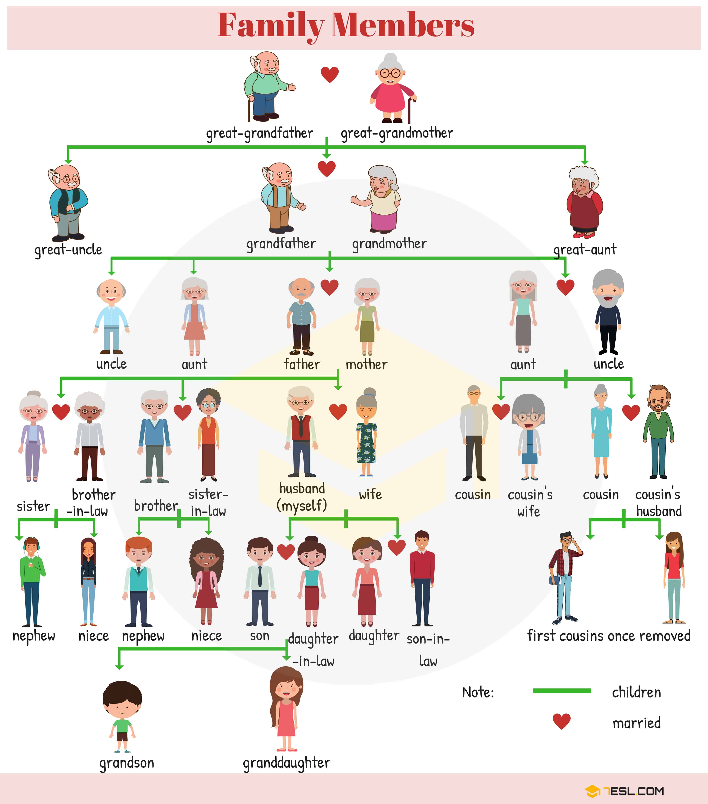

# neo4j-database-practice

## Terminology

- 

## Tutorials
- Spring Boot Basics. https://youtu.be/z2re1MfWtz0?si=0dCFnjN3f7IbhWuX
- how collect() works. https://neo4j.com/docs/cypher-manual/current/subqueries/collect/
- All forms of RequestMapping. https://www.baeldung.com/spring-requestmapping
- Structure of Spring Boot app. https://www.youtube.com/watch?v=D44si7o4ndg
- NOT POSSIBLE: Bidirectional relationship. https://graphaware.com/blog/neo4j/neo4j-bidirectional-relationships.html
- Lombok Cyclic Dependency issue. https://community.neo4j.com/t/logical-cyclic-mapping-dependency/47348
- Lombok Intro. https://www.baeldung.com/intro-to-project-lombok
-  how collect() works, https://neo4j.com/docs/cypher-manual/current/subqueries/collect/


## Queries

### User profile function notations
- https://docs.spring.io/spring-data/neo4j/docs/5.1.21.RELEASE/reference/html/#repositories.query-methods
- https://docs.spring.io/spring-data/neo4j/reference/repositories/core-concepts.html
- https://docs.spring.io/spring-data/neo4j/reference/repositories/query-methods-details.html
- https://www.baeldung.com/spring-data-derived-queries
- https://docs.spring.io/spring-data/neo4j/reference/repositories/custom-implementations.html
- https://docs.spring.io/spring-data/data-commons/docs/1.6.1.RELEASE/reference/html/repositories.html

### Create relation
```sql
-- does not account for duplicate relation, TODO
MATCH (a:Person WHERE ID(a) = 184)
MATCH (b:Person WHERE ID(b) = 185)
CREATE (a)-[:ACTED_IN ]->(b)
RETURN a, b
```

### Delete relation
```sql
MATCH (a:Person WHERE ID(a) = 184)
MATCH (b:Person WHERE ID(b) = 185)
-- this deletes only the relationship stated from a to b, remove ':ACTED_IN' to remove any relation.
MATCH (a)-[r:ACTED_IN ]->(b)
DELETE r
return a, b
```
### Finds relation

```sql
-- https://stackoverflow.com/questions/20704782/find-path-between-nodes-through-cypher
MATCH (a:Person WHERE ID(a) = 179)
MATCH (b:Person WHERE ID(b) = 182)
MATCH p = shortestPath((a)-[:ACTED_IN|HAHAHA*]->(b))
RETURN p
```

### Finds nodes

```sql
MATCH
  (a:Person WHERE ID(a) = 179),
  (c:Person WHERE ID(c) = 182)
RETURN a, c
```

### Find all Nodes with STARTS and IGNORECASE
```sql
MATCH (parentFirst:Person WHERE toLower(parentFirst.firstName) STARTS WITH toLower("jo")) 
return parentFirst
```

### Finds children from parent
```sql
MATCH (parent:Person {firstName: "joe"})-[r:HAS_CHILD*1..]->(child:Person)
RETURN parent, collect(r), collect(child)

--------------- OR ---------------

-- https://docs.spring.io/spring-data/neo4j/reference/appendix/custom-queries.html#custom-queries.for-relationships.long-paths
MATCH p=(a:Person {firstName: "joe"})-[r:HAS_CHILD*1..]->(:Person)
RETURN a, collect(nodes(p)), collect(relationships(p))
```

### Combination of create and find
```sql
MATCH (parent:Person {firstName: "joe"})
MATCH (child:Person {firstName: "abe"})
CREATE (parent)-[r:HAS_CHILD]->(child)
WITH parent
MATCH (parent)-[r:HAS_CHILD*1..]->(child)
RETURN parent, collect(r), collect(child)

-------------- NOT CONFIRMED -------------- 
MATCH (parent:Person {firstName: "joe"}) 
MATCH (child:Person {firstName: "abe"})  
CREATE (parent)-[r:HAS_CHILD]->(child)
WITH parent, r, child
RETURN parent, collect(r), collect(child)

------ CREATE NEW RELATION: --------------
-- A Method to Prevent Duplicate Nodes ---
-- https://stackoverflow.com/questions/56071228/how-to-avoid-duplicate-node
  -- "MERGE" is like "MATCH" and "CREATE" combined, and used accordingly based on the situation.
MERGE (parent:Person {firstName: "joe"})
MERGE (child:Person {firstName: "abe"})
MERGE (parent)-[r:HAS_CHILD]->(child) 
```


## TODO
- [ ] Determine generation on the fly (each time the page is loaded) or store in user node.
- [ ] Include "inlaw" status on user profile or do something else?
- [x] Why is the children property for findChildren empty?***, the saveChildRelationship should output the parent and its children when creating another new relation. https://stackoverflow.com/questions/77466175/problem-when-fetching-the-main-node-and-its-children-spring-data-neo4j
- [ ] Use a controller bc it combines the create and find has_child function. https://www.baeldung.com/spring-controllers
  - [x] https://www.youtube.com/watch?v=D44si7o4ndg
  - [x] https://www.youtube.com/watch?v=RrE9qpCxdD4
- [ ] If a parent with children marries, all children needs to be linked to new parent. (or do not do this bc step-parent...) 
- [ ] look into path parameters and @POST https://docs.spring.io/spring-data/neo4j/docs/current-SNAPSHOT/reference/html/
- [ ] use lombok for easier time making Person class https://projectlombok.org/features/Builder, https://projectlombok.org/features/Data
- [ ] look into unit testing with JUnit https://www.vogella.com/tutorials/JUnit/article.html


## FIXES
- If any issues starting localhost remote connection neo4j:
  - https://neo4j.com/docs/operations-manual/current/authentication-authorization/password-and-user-recovery/
  - check if neo4j has a new update (both Desktop version and WSL).
  - do neo4j status to check status, then do neo4j stop in terminal. 